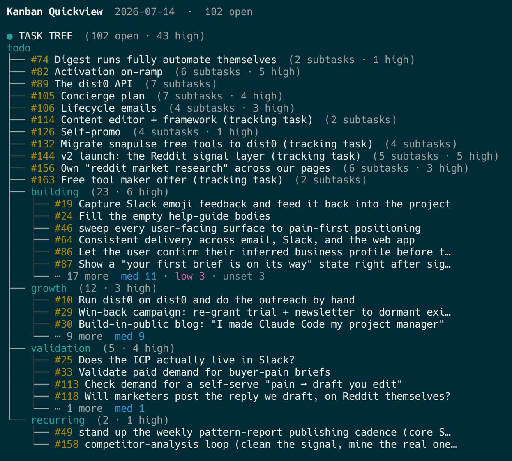

# Kanban skill — organize your task board in Markdown, right next to your code

A skill that lets Claude Code do project management for you — proposing the
next work, writing the cards, and archiving what's done. It's a **task board in Markdown**: your
backlog lives as plain Markdown files in `docs/kanban/` — in git, diffable, readable by both
you and the agent. Instead of tracking work in GitHub Issues or Linear, you steer the
board in plain language, straight from your terminal — call it **vibe kanban** if you like. No
database, no web app, no MCP.



It adapts to your project through a small **Configuration** block — your name, your
tracks, your docs. Everything else is generic.

## Install in one prompt

From your project root, tell Claude Code (or any coding agent that can run shell commands):

```
Set up the kanban skill for this project. Read
https://raw.githubusercontent.com/dist0com/kanban-skill/main/INSTALL_PROMPT.txt and follow it.
```

The agent copies the skill into `.claude/skills/kanban/`, reads your codebase to fill the
**Configuration** block, scaffolds the board under `docs/kanban/`, and proposes your first
three tasks. That's the whole setup — from then on you just talk to the board. See
[Install](#install) below for alternatives.

## Designed for solo founders

This skill is best suited for solo founders and small teams who don't want their work
scattered across Slack, GitHub, Notion, and a dozen other apps. Keep everything in one
place — your codebase — and you cut the context switching, the information silos, and the
tokens burned pulling state out of each app through MCP or screenshots.

For indie hackers, that means marketing, building, documentation, social proof, social
listening, and competitor tracking all living side by side in the same repo. When your
context isn't fragmented across tools, the LLM can compose across everything you have — and
that's where it does its best work.

## Tested with Claude Code + Opus

This skill is primarily developed and tested with **Claude Code** running an Opus-series
model, so that's the combination it works best with today. It's plain Markdown and a
dependency-free Node script under the hood, though, so nothing ties it to one agent. If you
run it with a different model — or a different coding agent entirely — we'd love your
feedback on how it holds up.

## Install

The skill is two things: a `SKILL.md` that tells Claude how to run the board, and a tiny
`kanban.mjs` script (Node, no dependencies) that is the only thing allowed to allocate
ids and edit metrics.

Installing is one prompt — you don't copy files or edit config by hand. Your agent reads
your codebase, fills in the setup, and scaffolds the board for you. The recommended path is
the [one-prompt install](#install-in-one-prompt) above, where the agent fetches
[`INSTALL_PROMPT.txt`](INSTALL_PROMPT.txt) and does everything for you, asking at most a
couple of questions where it genuinely can't infer a value.

### Alternative: paste the prompt yourself

If your agent can't fetch URLs, open [`INSTALL_PROMPT.txt`](INSTALL_PROMPT.txt) and paste
its contents into the agent instead — same result.

That's the whole setup. From then on you just talk to the board.

### Updating

Already installed and want a newer version? It's one prompt — and because the install copied
the update guide in with the skill, there's nothing to fetch first:

```
Update the kanban skill in this project. Read
.claude/skills/kanban/references/update.md and follow it.
```

Your settings live in one file (`.claude/skills/kanban/config.md`) and your board lives in
`docs/kanban/`. An update overwrites only the generic files (`SKILL.md`, `kanban.mjs`, the
references) and leaves those two alone, so you never lose your config or your tasks. Check
your installed version any time with `node .claude/skills/kanban/kanban.mjs version`.

### Requirements

- Claude Code (or any agent that can read skills and run shell commands).
- Node.js 18+ for `kanban.mjs` (standard library only — nothing to install).

## Using the board

Once installed, drive it in plain language — the skill triggers on these:

| You say | Claude does |
| --- | --- |
| "what's next?" | reads the board + your sources, proposes 3 new tasks |
| "add a task: …" | reviews the idea, writes a card, adds it to the index |
| "dive deeper on #4" | pushes card #4 one stage toward concrete |
| "review the board" | checks cards for clarity, duplication, done-ness |
| "#4 is done" | compresses it into `archive.md`, removes the card |

Under the hood, only `kanban.mjs` allocates ids or touches metrics:

```bash
node .claude/skills/kanban/kanban.mjs init [track...]     # scaffold a fresh board
node .claude/skills/kanban/kanban.mjs create [--count N]  # allocate ids
node .claude/skills/kanban/kanban.mjs archive <id>        # finish a task
node .claude/skills/kanban/kanban.mjs reject  <id>        # drop an idea
node .claude/skills/kanban/kanban.mjs run     <id>        # record one recurring-task run
node .claude/skills/kanban/kanban.mjs peek                # next free id
node .claude/skills/kanban/kanban.mjs metrics             # the daily CSV
```

See [the daily loop](docs/guides/daily-loop.md) for how to run the board day to day.

This repo **uses the skill on itself**: `docs/kanban/` is a real board tracking the
skill's own development, so you can see exactly what a filled-in setup looks like.

## Origin

Generalized from a kanban skill built for a single product ([dist0](https://dist0.com)).
The reusable version keeps the good bones — global ids, plain-language cards, the propose /
dive-deeper / archive loop, auto-pruning memory — and moves everything project-specific
into Configuration and presets.

## License

[Apache License 2.0](LICENSE). Free to use, modify, and redistribute. Contributions
welcome.
